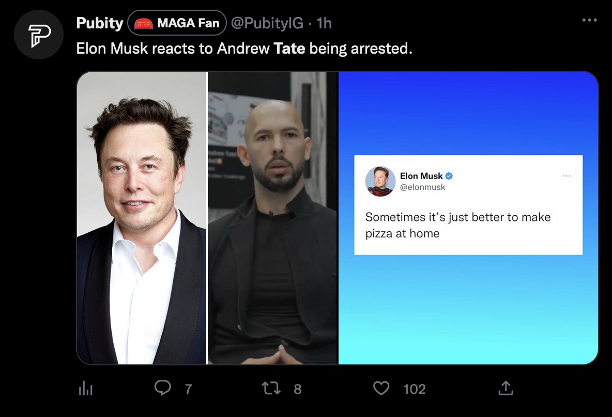

This is a modified version of the eight dollars browser extension which replaces the paid twitter blue logo with a MAGA hat

[Get it on the Chrome Web Store for Chrome or Brave](https://chrome.google.com/webstore/detail/kfjfoifgkmnalliggnfpjhnkgmklmoio)

Pending review for Firefox

# eight-dollars

eight-dollars can help you tell the difference between actual verified accounts and twitter blue users. Just install the extension and see the difference.

Maintained by [Will Seagar](https://twitter.com/willseagar), [Walter Lim](https://twitter.com/iWaltzAround), and [Ilia Sidorenko](https://twitter.com/noway421). 

Found this useful? [Buy us a $8 coffee here](https://www.buymeacoffee.com/eightdollars).

## Installation Instructions

### How to install on Chrome/Brave

[Download it on the Chrome Web Store](https://chrome.google.com/webstore/detail/eight-dollars/fjbponfbognnefnmbffcfllkibbbobki)

### How to install on Firefox

[Download it on the Firefox Browser Extensions page](https://addons.mozilla.org/en-US/firefox/addon/eightdollars/) 

### How to install on Edge

[Download it on the Microsoft Edge Add-ons page](https://microsoftedge.microsoft.com/addons/detail/eight-dollars/ehfacgbckjlegnlledgpkmkfbemhkknh) 

### How to install on Opera

1. [Vist the Chrome Web Store page](https://chrome.google.com/webstore/detail/eight-dollars/fjbponfbognnefnmbffcfllkibbbobki)
2. Click "Add to Opera"
3. Click "Install"

### How to install on Safari

Coming soon
